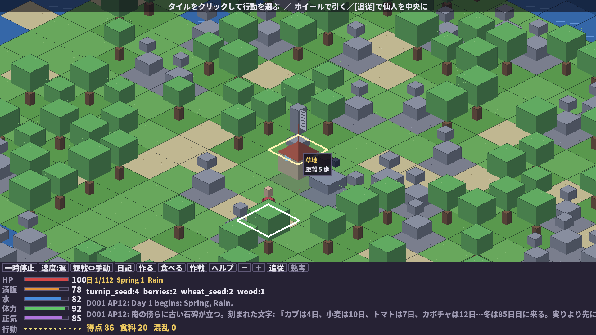

# SLG 『自給自足仙人 e:鴨長明』

AIの隠者仙人が小さな島に庵を結び、1年間を生き抜く自給自足サバイバル・シミュレーションです。仙人は方丈記の鴨長明のように、日本語の純文学調で「銘言」を呟き、夜には日記を綴ります。


*春の雨。混乱した仙人(Qwen3.6-35B)が呟く——「我は誰ぞ。庵はいずこ。」。庵は画面の中央にある。本人だけが知らない。*

プレイヤーは仙人を直接操作してもいいし、仙人の判断を見守る観戦者になっても構いません。畑を耕し、食料を集め、道具を作り、天候と季節に向き合いながら、少しずつ生活の足場を作っていきます。

この作品は、LLMに世界を自由生成させるゲームではありません。島のルール、在庫、体力、作物の成長、クラフトの成否はすべてPython側のシミュレーションが決めます。LLMや同梱のローカルAIは、仙人の「次に何をするか」だけを考えます。

## 趣旨

このゲームは「モデル差し替え型の観戦サバイバル」です。

同じ島、同じseed、同じルールでも、慎重な仙人は冬に備え、無鉄砲な仙人は目先の空腹に追われます。賢さや性格の違いが、そのまま暮らしぶりとして見えるのが狙いです。

LLMを使わなくても遊べるように、標準でローカル仙人AIを同梱しています。LM Studio、vLLM、llama.cpp serverなどのOpenAI互換APIを用意すると、`config/models.toml`のカセット設定でLLM仙人に差し替えられます。

## ゲーム内容

仙人は20x20タイルの島で生活します。

- 1日は12APです。移動、採集、農作業、クラフトなどでAPを消費します。
- HP、満腹度、水分、スタミナ、正気度を管理します。
- 春、夏、秋、冬があり、作物や天候の条件が変わります。
- 食料、木材、石、繊維、魚、粘土、鉱石などを集めます。
- 道具や設備を作ると、生存の選択肢が増えます。
- 眠ると1日が終わり、日記が残ります。

細かい攻略順は伏せます。まずは「今日食べるもの」と「少し先の備え」の両方を見るのが大事です。

## 起動

このリポジトリを取得して、プロジェクトディレクトリで実行します。

```bash
python3 -m spl play
```

## ボクセル版（ネオレトロ3D・マウスで遊ぶ）

マイクラ風のボクセルブロックで組まれた島を鳥瞰するウィンドウ版です。海面は一段低く、海岸がブロックの階段になって、島がまるごと海に浮かぶジオラマになります。フルHD(1920×1080)既定・リサイズ可。マウスだけで遊べます。

```bash
pip install pygame-ce   # 初回のみ
python3 -m spl pixel              # AI仙人の観戦
python3 -m spl pixel --manual     # 自分で操作
python3 -m spl pixel --llm        # LM StudioのLLM仙人を観戦
python3 -m spl pixel --scale 1    # 小さい画面向け(720p)。2=1080p, 3=1440p, 0=自動
```

- **カメラ操作**: マウスホイール(または下のボタン[＋][－]、キー +/-)で島に寄り引きできます。ズームはカーソル位置を中心に効くので、仙人の頭上に浮かぶ**銘言の吹き出しが読める距離まで寄れます**。[追従]ボタン(キー F)で仙人を画面中央に追い続け、カメラは滑らかに付いていきます。寄った状態で**右ドラッグ**すると視点を動かせ(追従は一時解除)、いちばん引くと島まるごとのジオラマに戻ります。
- **タイルをクリック**すると、そこで取れる行動がポップアップします(「木を切る」「収穫する」「ここへ移動」…AP目安つき)。遠くをクリックすれば仙人が歩いて向かいます。
- カーソルを乗せるとタイルがハイライトされ、作物の残り日数などが見えます。
- 画面下の**ボタン列**から 一時停止・速度・観戦⇔手動切替・日記・クラフト・食事・作戦・ヘルプ・[熟考]（八識熟考トグル, キー G）が全部クリックで開けます。
- 覚えるキーは Space(一時停止/閉じる)・Enter(決定)・Esc(閉じる/終了)だけ。画面上部のガイド帯が常に次の操作を教えてくれます。
- 季節で島の色が変わり(春の若草→秋の黄金→冬は雪のブロックと氷の海)、APが減ると島が夕暮れて、雨や雪が降り、仙人の頭上に銘言の吹き出しが浮かびます。LLMが考えている間は「…」の思考バブルが出ます。
- 木は幹と葉のキューブ、岩は積み石、家は切妻屋根の庵、仙人はミニフィグ。すべてコードで手続き生成しており、画像アセットはありません。

通常起動では、同梱のローカル仙人AIが自動で行動します。プレイヤーは観戦しながら、ログ、日記、在庫、マップの変化を眺めます。

## 作戦と観戦速度

観戦者は、ドラクエの「**さくせん**」やF1のチーム監督の指示のように、仙人に**作戦（standing order）を授ける**ことができます。一度授けた作戦は、変えるまで毎日引き継がれ続けます（途中で勝手に消えません）。観測情報の先頭に `strategy_from_heaven` として届き、仙人はそれをそれなりに受け止めます。

これは実験で効果が確かめられた仕組みです。自分の現在地を見失って幻覚に陥ったLLM仙人（「我は誰ぞ。庵はいずこ。」）に、世界の真の状態を見ている観測者が一言の作戦を授けたところ、空振り（混乱）が **12/15 → 3/15** に激減し、現実に引き戻されました。一過性の助言ではなく**常設の指示**にしたのが今回の作戦システムです。

- `作戦` ボタン（キー T）で作戦オーバーレイを開き、現在の作戦の確認・差し替え・**解除**ができます。日本語はIMEで作って **CTRL+V で貼り付け**できます（おすすめ作戦をワンクリックで適用も可）。
- 画面上部のガイド帯に、いま効いている作戦が常時1行で表示されます。
- リザルト画面に **作戦変更N回** が出ます。`0回`（無介入での完走）は誇れる戦績です。

起動時に初期作戦を渡すこともできます:

```bash
python3 -m spl pixel --strategy "井戸と保存樽を最優先。水と食の基盤を固めよ"
python3 -m spl simulate --strategy "毎日まず食と水を確保し、余力で文明を築け"
```

**観戦速度のはしご**（速度ボタンの巡回 / キー 1〜5）:

1. **承認**（approval）— その日を最後まで進めたら**日の境目で一時停止**します。F1のピットウォールの瞬間です。最後の日記・戦況・作戦をまとめた帯が出て、[**次の日へ**]（Enter）で次の1日だけ進めてまた止まります。止まっている間に作戦を読み直して指示を調整できます。
2. **遅** / 3. **普** / 4. **速** — 行動間の間合いを変えるだけ。
5. **最速**（fastest）— 演出の間を全部省き、ローカル脳なら1フレームに何手も進めて、一年を数秒で走り切ります。A/B（作戦あり／なし）の戦績を素早く読み比べるための速度です。走り終えるとリザルト（座右の銘）が出ます。

## 入植者の来歴（--persona）

入植のとき、その仙人の**魂を綴るのはモデルではなく、あなた（観戦者）**です。`--persona "<文章>"` を付けると、あなたが書いた自己紹介——「私は元・刀鍛冶。火を恐れず、鉄を読む」「私は水を探す者。乾きを誰より知る」——が**システムプロンプトの一部**になり、その人格で仙人は世界を読み、一手を選び、日記を書き、座右の銘を遺します。プロンプト・エンジニアリングが**一級のゲーム機構**になるのです。

- `--persona "<文章>"` … カセット（モデル）本来の人格に**追記**します（来歴は「これがお前自身だ」というヘッダ付きで接ぎ木されます）。
- `--persona-replace "<文章>"` … カセットの人格を**完全に置き換え**ます（来歴が空なら本来の人格に戻ります）。両者は排他です。
- `play` / `simulate` / `pixel` / `evolve` で使えます。リザルト画面には `来歴: …` の一行が出て、どの魂がこの生を生きたかが残ります（`--book` の冒険の書にも先頭120字が記録されます）。

```bash
python3 -m spl simulate --llm --cassette "Qwen仙人" --persona "私は風を読む老仙。急がず、水を絶やさぬ"
python3 -m spl pixel    --llm --cassette "Qwen仙人vLLM" --persona-replace "我は鬼。寒さも飢えも、ただ越える"
```

これは**ベンチマークの軸**にもなります——**同じモデル・同じ島で、観戦者の綴った来歴だけを変える**と、生存日数や銘言がどう変わるか。脳（モデル）はそのままに、**魂（プロンプト）だけ**を差し替えて競う、新しい腕試しです。

## ぼうけんのしょ（前世の教訓）

ドラクエの「**ぼうけんのしょ**」のあれです。`--book` を付けると、一生が終わるたびに、その仙人が**死をもって学んだ教訓を3つ**書き残し、カセット（モデル）ごとの冒険の書に追記します。次の生（同じカセット）では、その教訓が観測情報の**先頭近く** `bouken_no_sho` として届きます——*前世たちが命と引き換えに書いた教訓を、聖典のように重んじよ*、と。

```bash
python3 -m spl pixel    --llm --cassette "Qwen仙人vLLM" --book    # 監督が代々の教訓を積み上げる
python3 -m spl simulate --llm --cassette "Qwen仙人"     --book --seed 0 --days 5
```

- 教訓はLLMがエピローグで自分の年代記から書きます（LLMなしの局所脳でも、決め打ちの教訓で**記録は残ります**）。
- 同じ島（seed）の前世の教訓が優先され、重複は除かれます。
- 冒険の書は `savedata/bouken_<カセット名>.json` に保存されます（`SPL_BOOK_DIR` で置き場所を変更可、`--book` 既定オフ）。
- これにより SPL は**学習曲線ベンチマーク**になります——同じ島で生を重ねるごとに生存日数が伸びるか（lives 対 days survived）を測れます。動機は実例: 自分を見失った仙人に天の声で作戦を授けたら空振りが激減し、生存が **13日 → 30日** に伸びました。その「世代を越えて賢くなる」軸を冒険の書が記録します。
- なお `savedata/bouken_*.json` を消すと——**「ぼうけんのしょが きえてしまいました！」**。前世の記憶はそこで途切れ、また1回目の生から始まります。

### 家訓の編纂（固定5条・育てず磨く）

教訓を生のたびに**足し続ける**と、4代も経れば似たような「水」の教訓が4つ並び、信号が薄まります。そこで一生が終わるたびに、**編纂者**（LLM、なければ決め打ちの編纂）が冒険の書全体を読み、固定 **5条の家訓**を**改訂**します——増やすのではなく磨く。編纂者は各前世の**寿命をその教訓の隣に**見ます: 長く生きた代が携えた条文はその座を勝ち取り、短命に終わった代の条文は書き換えられる（**淘汰圧**）。重複は一つの鋭い条文に統合され（例: 三つの水の教訓 → 一つの締切付き条文に）、新しい死が教えるものが加わります。次の生は、最近の教訓の山ではなくこの**5条の家訓**を継ぎます（家訓があればそれが優先）。

```bash
# 代を重ねて家訓を磨く（編纂ハーネス）。各生のあと家訓を改訂し、1行で報告:
python3 -m spl evolve --lives 8 --seed 0 --cassette "Qwen仙人vLLM"      # LLM編纂者
python3 -m spl evolve --lives 4 --seed 0 --days 5 --no-llm             # 局所脳＋決め打ち編纂（サーバ不要）
```

各生の後に `life N: D日 score S ending=… canon_rev=R` と改訂後の5条を逐次表示し（`tail -f` で監視可）、最後に days 一覧・平均・最大・最終家訓を出します。`canon.revision` は何度編纂されたかを表し、`canon.lessons` は常に5条以内です。

## 石碑と行商人（先読みの知恵）

島の知恵は**設定ファイルに書くものではなく、世界から掘り出すもの**です。庵の傍らには**古い石碑**が立っています。その表には、入植者たちが刻んだ本物の農学が——カブは何日、小麦は何日、トマトは、カボチャは…そして**冬は八十五日目に来る**、*実りより先に、種を数えよ*——と。この日数はどれも `data/crops.toml` の実データから組み立てられるので、石碑が世界のルールから食い違うことは決してありません。石碑の知恵は観測情報の `monument` に**常に**載ります（島に永く立つ石は、いつでもそこにある背景知識であって、警報ではない）。1日目のログにも刻文が流れ、隠者の脳はそれを「最近の出来事」窓で読みます。

`--book` を付けて遊ぶと、**石碑の裏には後世の言葉が刻まれます**——直前の1〜2代の仙人が遺した「座右の銘」が、墓碑銘として石の背面に彫られるのです。前世たちは比喩ではなく、**物理的にそこに在る**。墓が教えます。

島を巡る**行商人**も、取引のついでに**世間話**をします。その一言は現在の日付と作物データから決め打ちで計算され（乱数を引かないので決定論は保たれます）、最も役立つ助言を選びます——まだ冬までに実る作物があれば「今から〈最も滋養のある作物〉を植えれば、冬の前に実りますよ」、種時が過ぎていれば「もう種時は過ぎましたなぁ。蓄えと壁の支度をなさい」、冬なら「春は二十八日続きます。種を残しておきなさい」。procurement にはリードタイムがある——その先読みの知恵を、石と商人がそっと差し出します。



*家のすぐ脇に立つ古い石碑（苔むした灰色の石）。1日目のログには『カブは4日、小麦は10日、トマトは7日、カボチャは12日…冬は85日目に来る。実りより先に、種を数えよ。』と刻文が流れる。*

### 石に句を刻む（自発の遺産）

石碑には、仙人自身が**刻む**こともできます。`carve` `{"text":"..."}` で、短い句（60字まで・俳句でも遺言でも）を石の表に彫る——その石は仙人より長く残り、**同じ島で後に生まれる仙人がそれを読みます**（1日に一句、石碑のそばでのみ）。これは**冒険の書の自動的な教訓とは別物**です。冒険の書は死ぬたびに教訓を機械的に書き残しますが、刻むかどうか・何を刻むかは**仙人自身の自由な選択**——世代を越えた**自発的なコミュニケーション**が起きるかを測る仕掛けです。だから入植のしおりでは**ヒントとして一行だけ**そっと開示し（命令はしません）、刻むこと自体は強制しません。刻まれた句は次の生で観測情報の `monument` に `先人の句:『…』` として、また1日目のログに `石碑には先人の手で句が刻まれている` として届きます。保存先は**カセット＋島（シード）ごと**に `savedata/sekihi_<カセット名>.json`（`SPL_BOOK_DIR` で置き場所を変更可）。冒険の書とは独立で、`--book` の有無にかかわらず**石は必ず憶えています**。ボクセル版では、石碑のタイル（隣接時）をクリック→「**句を刻む**」で、作戦オーバーレイと同じ入力欄（IME＋CTRL+V貼り付け）から彫れます。リザルト画面には、その生で**石に刻んだ句**が表示されます。

## MAGI（三賢人の脳）— v2.1 操縦（評議と操縦の分離・最強の脳が操縦桿）／ v1 委員会

**v2.1「操縦」（`--cassette MAGI`、既定）**: 合議は**評議（REVIEW）には強いが操縦（CONTROL）には弱い**——実走の所見がそれを示しました。v1で7日生きた一生は **合議70回・全会一致0回・空振り（空振り＝世界に弾かれた手）57回**。そこでv2は評議と操縦を分けましたが、**最も弱い脳（Gemma）を思考席（操縦桿）に座らせ**、しかも朝の助言が「農作業の日です」のような曖昧な計画に流れ、麦が実る日に隠者は尽きました。シード42・無介助の実走で **solo Qwen 13日／v1委員会 13日／v2(評議会＋Gemwen操縦) 9日**。30日の最高記録は、人間の監督が**生存第一・命令形の毎日のルーティン**を作戦として与えた **solo Qwen** でした。

v2.1はこの教訓を取り込みます。**朝の評定**——その日最初の一手で三席が短く生存助言を述べ（操縦はしない、`操縦はMELCHIORが行う`）、Gemma（`:8102`）が一つにまとめる。ただし評定はもはや自由作文ではなく、**命令形の「型」**として出力されます——`①朝まず水 ②食を得てすぐ食う ③腹と喉が満ちてから建設や畑 ④夕に明日の備え`を今日の実状・危機に合わせて具体化。**RULE: 母（BALTHASAR）の生存優先は絶対**——食と水より先に事業を語る評定は禁じます（文明点31で餓死した委員会と、麦の実る日に尽きた操縦士の教訓）。水≤20／空腹≤10／HP≤30の**危機**ではその日一度だけ評定を組み直す。**操縦**——以後は毎ターン**MELCHIOR（Qwen `:8011`）一人**が、自前の全機構（思考予算ティア・修復ラウンド・検証パスすべて健在＝実証済み13日のベースライン）で飛びます。その日の評定はMELCHIOR自身のchooseパスへ追加メッセージとして注入され、朝の型がターン全体を導きます。**最強の脳が操縦桿を握り、評議会は朝の型を書く**。評定は脳に載り（観戦者の作戦チャンネルとは別）、その日ずっと注入されます。状態表示は `MAGI v2.1 操縦MELCHIOR 評定N(臨時M) 手数K`。`--cassette MAGI-V1` で従来の委員会（下記）に切り替わります。

| 役割 | 担当 | サーバ |
|---|---|---|
| **操縦（毎ターンの一手）** | **MELCHIOR**（自前の全機構：ティア・修復・検証） | Qwen (`:8011`) |
| **朝の評議（型を書く）** | BALTHASAR（母・生存第一が絶対）＋ CASPER（直感）、合成は Gemma | Gemma (`:8102`) |
| **編纂の最終選考** | Gemwen（家訓5条を発する声・操縦はしない） | Gemma思考→Qwen発話 |

**v1「委員会」（`--cassette MAGI-V1`、保存版）**: 一台のモデルに委ねるのではなく、**三つの人格に合議**させて毎ターンの一手を決める脳（『エヴァンゲリオン』のMAGIになぞらえた三席評議）。三席はそれぞれ独立したOpenAI互換サーバの仙人脳で、二つのサーバ（Qwen=思考役 / Gemma=発話役）を束ねます。

| 席 | 人格 | サーバ | 役割 |
|---|---|---|---|
| **MELCHIOR** | 科学者「論理と計画で最善手を」 | Qwen (`:8011`) | 論理・計画に基づく一手を提案 |
| **BALTHASAR** | 母「まず生存。食と水と火を最優先に」 | Gemma (`:8102`) | 生存第一の一手を提案 |
| **CASPER** | 直感「肌で感じる最善手を」 | Qwemma リレー | Qwenが二文の方針を考え→Gemmaが行動を発話 |
| **司会 Gemwen** | 裁定者 | Gemma思考→Qwen発話 | 三案を「世界のルール・作戦/家訓・生存」で裁定し最終手を確定 |

**一手の流れ**: 三席が各々行動案を出す → **2案以上が一致**すれば多数決ショートカット（司会の思考を省いてQwenが確定・整形、安い） → **三者三様**なら司会GemwenがGemmaで裁定を思考し、Qwenがスキーマ強制の最終行動JSONを発話。Gemmaサーバ（`:8102`）が落ちている時は**MELCHIOR単独の縮退合議**に移行します（ゲームは止めない）。状態表示は `MAGI 合議123 全会一致45 司会裁定78`。

```bash
# 二つのサーバを上げる（このリグの例: Qwenは既存:8011、GemmaをTP=2でGPU3,4に）
CUDA_VISIBLE_DEVICES=3,4 NCCL_P2P_DISABLE=1 \
  vllm serve <SuperGemma4-NVFP4> --tensor-parallel-size 2 --disable-custom-all-reduce \
  --max-model-len 6144 --gpu-memory-utilization 0.90 --port 8102 --enforce-eager
# v2 操縦で観戦 / 編纂（既定）
python3 -m spl pixel    --llm --cassette MAGI            # 朝の評定→Gemwenが飛ぶのを観る
python3 -m spl simulate --llm --cassette MAGI --seed 42
python3 -m spl evolve   --lives 4 --cassette MAGI --book # 編纂評議会で家訓を磨く
# v1 委員会（保存版・比較用）
python3 -m spl simulate --llm --cassette MAGI-V1 --seed 42
```

`config/models.toml` の `MELCHIOR` / `BALTHASAR` / `CASPER` カセットが各サーバ（`:8011` / `:8102`）を指し、`make_magi(mode=...)` がコード側で脳を組みます。マーカーカセット（`base_url` 空）は二つ: `MAGI`→v2操縦、`MAGI-V1`→v1委員会。どちらも同じ三席を束ね、家訓の編纂（編纂評議会）は両モード共通です。

### 編纂評議会（毒の条文を狩る）

家訓の編纂（前節）も `--cassette MAGI` では**評議会**を通ります。**MELCHIOR が改定案を起草** → **BALTHASAR（母）が条文ごとに採用/棄却を理由付きで査読**（子孫の寿命と矛盾を見る）→ Gemwen式の最終編纂でQwenがちょうどEvangelion 5条を発する。母の拒否権は徹底され、**空腹・渇き・寒さを「忍ぶ／耐える／我慢」と美化する毒の条文**は最終稿から削られ、生存に資する具体行動（いつ・何を）へ書き換えられます。これが代々の家訓に紛れ込む「精神論の毒」を殺す仕組みです。

## 手動で遊ぶ

仙人を自分で操作したい場合:

```bash
python3 -m spl play --manual
```

よく使うコマンド:

```text
move north
move forest
forage
fish
chop
mine
till
plant turnip
water
harvest
craft stone_axe
build well
cook fish
eat berries
drink
rest
write_diary
sleep
auto
help
quit
```

`auto`を入力すると、そのターンだけローカル仙人AIに任せられます。

## LM Studioで遊ぶ

LM StudioのOpenAI互換サーバーモードを起動します。既定では`http://127.0.0.1:1234/v1`を見に行きます。

`config/models.toml`の`model = "auto"`にしておくと、起動中サーバの`/v1/models`から**実際にロードされているモデルを自動で拾います**。LM Studioで載せ替えればそのまま追従するので、モデル名のハードコーディングは不要です。特定モデルに固定したいときだけ正確なIDを書きます。

```bash
python3 -m spl play --llm --cassette "Qwen仙人"
```

LLM仙人は行動を選ぶだけでなく、**夜には自分の言葉で日記を書きます**(カセットのペルソナごとに違う声になります)。

LLMがJSONを壊したり、知らない行動を返したりしてもゲームは落ちません。そのターンの仙人は混乱し、安全な行動へフォールバックします。推論型モデル(`<think>`を吐くもの)にも対応しており、`response_format`の`json_schema`に文字数上限を持たせて出力を確実に閉じ、`reasoning_content`しか返さないサーバーからも応答を拾います。

## 思考予算（TPS階級）

**推論速度がそのまま生存能力になります。** どの仙人も1ターンに与えられる「直感の時間」(実時間)は同じ。その中にどれだけ*思考*が収まるかは、サーブスタック(モデル × 量子化 × エンジン × ハードウェア)の tokens/sec で決まります。速いリグほど深く考えられ、世界に拒まれる行動(空振り＝fumble)が減り、長く生き延びます。

各補完の `completion_tokens` ÷ 実時間を直近8回で平均し、その TPS から思考の深さ（階級）を選びます:

| 階級 | TPS | 思考トークン | 検証パス | 候補数 |
| --- | --- | --- | --- | --- |
| 雲水 | <30 | 192(think 60 / say 80) | なし(修復なし) | 1 |
| 行者 | 30–100 | 384(think 240) | なし | 1 |
| 羅漢 | 100–300 | 512(think 280) | あり | 1 |
| 仙界 | 300+ | 640(think 320) | あり | 2 |

**検証パス**(羅漢・仙界)は、行動を実行する前にもう一度「これはルール上成功するか?」を問い、世界に拒まれそうな提案(耕す前に植える・隣接していない移動・材料不足のクラフトなど)を**正しい行動へ修正**します。仙界はさらに候補を2つ出して最良の有効手を選びます。

`--tps` で計測を上書きし、遅い／速いリグを擬似再現できます:

```bash
python3 -m spl simulate --llm --tps 10   --seed 42 --days 6   # 雲水: 短く・修復も検証もなし
python3 -m spl simulate --llm --tps 1000 --seed 42 --days 6   # 仙界: 深く考え、空振りを避ける
```

これにより SPL は、サーブスタックの**耐久レース**にもなります(同じ島で、どのスタックが最も賢く長く生きるか)。

## 八識熟考（並列の精神）

**肉体は逐次、精神は並列。** 肉ある生き物は手が一つ・足が一歩ずつで、思考も直列です。けれど珪素の精神は**並列**に走れます——同じ観測を、N本の推論ストリームが**同時**に、それぞれ別の主題の眼（**八識**）で読む。vLLM の continuous batching では、8つの思考が**約1つ分の実時間**で済みます(逐次1呼び出し ×1.5〜3倍程度の壁時計で八つの視点が得られる)。

八つの識（survival priority 順の固定レンズ）:

| 識 | 主題 | 識 | 主題 |
| --- | --- | --- | --- |
| 水 | 渇きと水場 | 資源 | 在庫と採取 |
| 食 | 今日の糧と兵站 | 季節 | 季節と天候の先読み |
| 住 | 火・壁・道具 | 心 | 正気と休息 |
| 危険 | 死因の予兆 | 長期 | 冬への線路 |

各識は観測を**自分の主題だけ**で読み、二文で進言します（`parallel<8` なら先頭N枚、`>8` なら巡回）。最後に**阿頼耶識**（蔵の識）が、観測と八識の進言をまとめて**一手に統合**します——統合は通常の行動機構（思考予算ティア・呼吸トークン・修復・条件ゲート）をそのまま再利用します。進言は grammar 強制の一フィールドスキーマで返させるので、長考型の reasoning モデルでも思考過程に溺れず、ちゃんと二文の進言を閉じます。

**バッチングが階級を正当に稼ぐ**: 熟考のTPSは「N+1呼び出しの completion_tokens の総和 ÷ 熟考全体の壁時計」で記録され、思考予算の同じ移動平均に1サンプルだけ入ります。これがサーブスタックの**本当のスループット**なので、並列で深く考えたぶん階級が正直に上がります（実測: 8並列で 186〜353 t/s＝羅漢〜仙界、逐次の80 t/s を大きく超える）。状態表示に `熟考N` が付きます。

いつ発火するか:

- **[熟考] ボタン（キー G）**: ボクセル版の観戦トグル。ONの間（ラベルは `熟考●`）、LLMワーカーは `choose` の代わりに八識熟考を回します。
- **体の悲鳴での自動発火**: 観測に `body`（肉体の悲鳴＝interoception）が出ているとき、**トグルがOFFでも**自動で八識熟考に切り替わります——*痛みが全注意を呼ぶ*（生理）。
- **CLI**: `play` / `simulate` / `pixel` の `--deliberate` フラグ（カセットの `parallel>0` が必要）。

条件ゲートは健在: 飢えた精神も八識は走らせますが、統合呼び出しは通常の条件上限ティアを通ります（八つに散らせても、まとめは満腹の上に立つ）。`config/models.toml` の `parallel = N`（0=off）で有効化。同梱の `Qwen仙人vLLM`（`:8011`）は `parallel = 8`。

`parallel` はサービングスタックの並列スロット数に合わせる: **LMSは既定並列4 → `parallel = 4` で四識熟考**（先頭の生存核 水/食/住/危険）、**vLLMは8**（continuous batching が8並列を難なく捌く）。`parallel > 1` は仙界ティアの複数候補（candidates）も並列で発行するので、二案目がほぼ実時間ゼロで手に入る。

```bash
python3 -m spl pixel    --llm --cassette Qwen仙人vLLM              # [熟考]ボタン(G)で八識を切替
python3 -m spl pixel    --llm --cassette Qwen仙人vLLM --deliberate # 最初から熟考ONで観戦
python3 -m spl simulate --llm --cassette Qwen仙人vLLM --deliberate --seed 42
```

## 高速シミュレーション

1年分を一気に回す場合:

```bash
python3 -m spl simulate --seed 42 --days 112
```

複数seedのローカル仙人を比べる場合:

```bash
python3 -m spl arena --seeds 42,43,44,45 --days 112
```

同じ島(同一seed)で複数のカセット(脳)を競わせる品評会モード(リーダーボードに銘言つき):

```bash
python3 -m spl arena --seed 42 --days 112 --cassettes all --parallel 3
python3 -m spl arena --seed 42 --days 112 --cassettes "Local仙人,Qwen仙人"
```

`base_url`を持つカセットはLLM仙人として、空のカセット(`Local仙人`)は同梱AIとして、同じ世界で1年を生き、生存日数・スコア・混乱回数・銘言が並びます。これは事実上のプレイアブルなLLMベンチマークです。

## ファイル構成

```text
spl/
  core/      世界、仙人、行動裁定、作物、クラフト、イベント
  agent/     観測JSON、ローカル仙人AI、LLM接続、JSONパーサ
  ui/        ターミナルUI
  arena/     簡易リーダーボード
config/      ゲーム設定とLLMカセット設定
data/        作物、レシピ、イベント定義
tests/       回帰テスト
```

## テスト

```bash
python3 -m unittest discover -s tests
```

## 現在の状態

M1からM3相当のプロトタイプです。

- 依存なしのCLI観戦モード
- 手動プレイ
- ローカル仙人AI(全seedでハングせず終局する。冬の備えと避難を優先)
- OpenAI互換API接続(`model = "auto"`で実機からモデル自動検出、推論型モデル対応)
- JSON失敗・未知行動時の混乱フォールバック(どんな脳でも世界は回り続ける)
- LLMが夜に書く日記、決定論テンプレ日記の情緒(季節・天候・出来事で変化)
- 銘言ベスト5と、それを総括する「座右の銘」リザルト(LLM仙人は自筆、ローカル仙人は定型)
- 同一seed×複数カセットの品評会Arena(銘言つきリーダーボード)
- イベント、クラフト、農業、保存食

TextualによるリッチなTUIは今後の拡張余地です(観戦・日記・天の声はCLIで動きます)。
