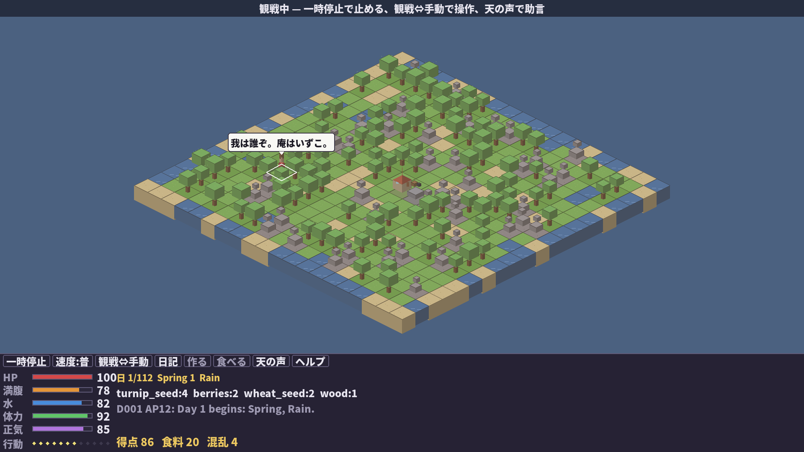

# SLG 『自給自足仙人 e:鴨長明』

AIの隠者仙人が小さな島に庵を結び、1年間を生き抜く自給自足サバイバル・シミュレーションです。仙人は方丈記の鴨長明のように、日本語の純文学調で「銘言」を呟き、夜には日記を綴ります。



*春の雨。混乱した仙人(Qwen3.6-35B)が呟く——「我は誰ぞ。庵はいずこ。」。庵は画面の中央にある。本人だけが知らない。*

プレイヤーは仙人を直接操作してもいいし、仙人の判断を見守る観戦者になっても構いません。畑を耕し、食料を集め、道具を作り、天候と季節に向き合いながら、少しずつ生活の足場を作っていきます。

この作品は、LLMに世界を自由生成させるゲームではありません。島のルール、在庫、体力、作物の成長、クラフトの成否はすべてPython側のシミュレーションが決めます。LLMや同梱のローカルAIは、仙人の「次に何をするか」だけを考えます。

## 趣旨

このゲームは「モデル差し替え型の観戦サバイバル」です。

同じ島、同じseed、同じルールでも、慎重な仙人は冬に備え、無鉄砲な仙人は目先の空腹に追われます。賢さや性格の違いが、そのまま暮らしぶりとして見えるのが狙いです。

LLMを使わなくても遊べるように、標準でローカル仙人AIを同梱しています。LM Studio、vLLM、llama.cpp serverなどのOpenAI互換APIを用意すると、`config/models.toml`のカセット設定でLLM仙人に差し替えられます。

## ゲーム内容

仙人は20x20タイルの島で生活します。

- 1日は12APです。移動、採集、農作業、クラフトなどでAPを消費します。
- HP、満腹度、水分、スタミナ、正気度を管理します。
- 春、夏、秋、冬があり、作物や天候の条件が変わります。
- 食料、木材、石、繊維、魚、粘土、鉱石などを集めます。
- 道具や設備を作ると、生存の選択肢が増えます。
- 眠ると1日が終わり、日記が残ります。

細かい攻略順は伏せます。まずは「今日食べるもの」と「少し先の備え」の両方を見るのが大事です。

## 起動

このリポジトリを取得して、プロジェクトディレクトリで実行します。

```bash
python3 -m spl play
```

## ボクセル版（ネオレトロ3D・マウスで遊ぶ）

マイクラ風のボクセルブロックで組まれた島を鳥瞰するウィンドウ版です。海面は一段低く、海岸がブロックの階段になって、島がまるごと海に浮かぶジオラマになります。フルHD(1920×1080)既定・リサイズ可。マウスだけで遊べます。

```bash
pip install pygame-ce   # 初回のみ
python3 -m spl pixel              # AI仙人の観戦
python3 -m spl pixel --manual     # 自分で操作
python3 -m spl pixel --llm        # LM StudioのLLM仙人を観戦
python3 -m spl pixel --scale 1    # 小さい画面向け(720p)。2=1080p, 3=1440p, 0=自動
```

- **タイルをクリック**すると、そこで取れる行動がポップアップします(「木を切る」「収穫する」「ここへ移動」…AP目安つき)。遠くをクリックすれば仙人が歩いて向かいます。
- カーソルを乗せるとタイルがハイライトされ、作物の残り日数などが見えます。
- 画面下の**ボタン列**から 一時停止・速度・観戦⇔手動切替・日記・クラフト・食事・天の声・ヘルプが全部クリックで開けます。
- 覚えるキーは Space(一時停止/閉じる)・Enter(決定)・Esc(閉じる/終了)だけ。画面上部のガイド帯が常に次の操作を教えてくれます。
- 季節で島の色が変わり(春の若草→秋の黄金→冬は雪のブロックと氷の海)、APが減ると島が夕暮れて、雨や雪が降り、仙人の頭上に銘言の吹き出しが浮かびます。LLMが考えている間は「…」の思考バブルが出ます。
- 木は幹と葉のキューブ、岩は積み石、家は切妻屋根の庵、仙人はミニフィグ。すべてコードで手続き生成しており、画像アセットはありません。

通常起動では、同梱のローカル仙人AIが自動で行動します。プレイヤーは観戦しながら、ログ、日記、在庫、マップの変化を眺めます。

## 手動で遊ぶ

仙人を自分で操作したい場合:

```bash
python3 -m spl play --manual
```

よく使うコマンド:

```text
move north
move forest
forage
fish
chop
mine
till
plant turnip
water
harvest
craft stone_axe
build well
cook fish
eat berries
drink
rest
write_diary
sleep
auto
help
quit
```

`auto`を入力すると、そのターンだけローカル仙人AIに任せられます。

## LM Studioで遊ぶ

LM StudioのOpenAI互換サーバーモードを起動します。既定では`http://127.0.0.1:1234/v1`を見に行きます。

`config/models.toml`の`model = "auto"`にしておくと、起動中サーバの`/v1/models`から**実際にロードされているモデルを自動で拾います**。LM Studioで載せ替えればそのまま追従するので、モデル名のハードコーディングは不要です。特定モデルに固定したいときだけ正確なIDを書きます。

```bash
python3 -m spl play --llm --cassette "Qwen仙人"
```

LLM仙人は行動を選ぶだけでなく、**夜には自分の言葉で日記を書きます**(カセットのペルソナごとに違う声になります)。

LLMがJSONを壊したり、知らない行動を返したりしてもゲームは落ちません。そのターンの仙人は混乱し、安全な行動へフォールバックします。推論型モデル(`<think>`を吐くもの)にも対応しており、`response_format`の`json_schema`に文字数上限を持たせて出力を確実に閉じ、`reasoning_content`しか返さないサーバーからも応答を拾います。

## 高速シミュレーション

1年分を一気に回す場合:

```bash
python3 -m spl simulate --seed 42 --days 112
```

複数seedのローカル仙人を比べる場合:

```bash
python3 -m spl arena --seeds 42,43,44,45 --days 112
```

同じ島(同一seed)で複数のカセット(脳)を競わせる品評会モード(リーダーボードに銘言つき):

```bash
python3 -m spl arena --seed 42 --days 112 --cassettes all --parallel 3
python3 -m spl arena --seed 42 --days 112 --cassettes "Local仙人,Qwen仙人"
```

`base_url`を持つカセットはLLM仙人として、空のカセット(`Local仙人`)は同梱AIとして、同じ世界で1年を生き、生存日数・スコア・混乱回数・銘言が並びます。これは事実上のプレイアブルなLLMベンチマークです。

## ファイル構成

```text
spl/
  core/      世界、仙人、行動裁定、作物、クラフト、イベント
  agent/     観測JSON、ローカル仙人AI、LLM接続、JSONパーサ
  ui/        ターミナルUI
  arena/     簡易リーダーボード
config/      ゲーム設定とLLMカセット設定
data/        作物、レシピ、イベント定義
tests/       回帰テスト
```

## テスト

```bash
python3 -m unittest discover -s tests
```

## 現在の状態

M1からM3相当のプロトタイプです。

- 依存なしのCLI観戦モード
- 手動プレイ
- ローカル仙人AI(全seedでハングせず終局する。冬の備えと避難を優先)
- OpenAI互換API接続(`model = "auto"`で実機からモデル自動検出、推論型モデル対応)
- JSON失敗・未知行動時の混乱フォールバック(どんな脳でも世界は回り続ける)
- LLMが夜に書く日記、決定論テンプレ日記の情緒(季節・天候・出来事で変化)
- 銘言ベスト5と、それを総括する「座右の銘」リザルト(LLM仙人は自筆、ローカル仙人は定型)
- 同一seed×複数カセットの品評会Arena(銘言つきリーダーボード)
- イベント、クラフト、農業、保存食

TextualによるリッチなTUIは今後の拡張余地です(観戦・日記・天の声はCLIで動きます)。
